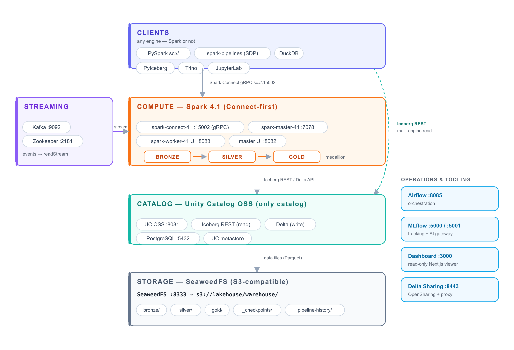
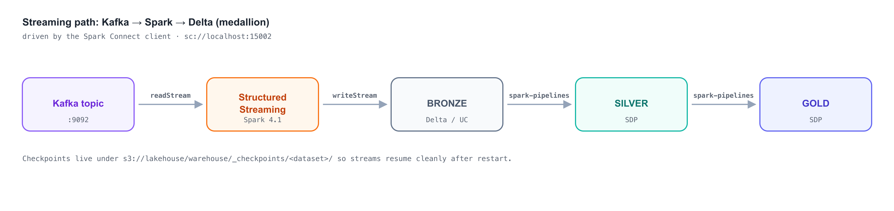

# open-lakehouse

> An open reference architecture for the lakehouse — Spark 4.1 (Connect-first), Kafka, Airflow, Iceberg, Delta, Unity Catalog OSS, MLflow, every layer open source. Runs locally on Docker, deploys to AWS. Made and maintained by Databricks; designed to be set up and torn down by an AI agent.

The lakehouse is **open by design** — open table formats (Delta Lake, Apache Iceberg), an open catalog (Unity Catalog OSS), and open compute (Apache Spark), with no proprietary storage layer and no vendor lock-in. **open-lakehouse** is a reference architecture that shows those pieces composing into one working stack you can stand up on your own infrastructure, run end-to-end, and tear down cleanly.

It's made and maintained by **Databricks**, which originated and open-sourced much of the stack — Apache Spark, Delta Lake, Unity Catalog, and MLflow are all Databricks-authored OSS projects. This repo is where those projects are shown running together as a single coherent platform: Unity Catalog OSS as the only catalog, Connect-first transport, and AI-skill scaffolding clean enough that an agent (or a human) can operate the whole thing from the READMEs. Demos live under [`demos/`](demos/) — ten are built out today, each following a fixed README contract so any demo can be run just by reading its README.

## Stack

| Layer | Component | Version |
|-------|-----------|---------|
| Compute | Apache Spark | 4.1.0 |
| Client transport | **Spark Connect** (gRPC, port 15002) | bundled with Spark 4.1 |
| Streaming | Apache Kafka | 3.6 |
| Orchestration | Apache Airflow | 3.1.6 |
| Open table formats | Apache Iceberg / Delta Lake | 1.10 / 4.3.1 |
| Catalog | Unity Catalog OSS | 0.5.0 |
| Experiment tracking | MLflow | 3.14 |
| Object store | SeaweedFS (S3-compatible) | — |
| Metastore | PostgreSQL | 16 |
| Data sharing | Delta Sharing server (OpenSharing + proxy, port 8443) | 1.3.10 |
| Dashboard | Read-only Next.js viewer (port 3000) | — |

All components are Apache-2.0 or Apache-compatible permissive licenses. See [NOTICE](NOTICE).

## Architecture

<p align="center">
  <picture>
    <source media="(prefers-color-scheme: dark)" srcset="docs/img/architecture-dark.png">
    
  </picture>
</p>

Four layers, one catalog, one Spark version:

- **Clients** — Spark or not — reach **compute** over Spark Connect gRPC (`sc://localhost:15002`). Non-Spark engines (DuckDB, Trino, PyIceberg) read straight from the catalog over Iceberg REST, no Spark required.
- **Compute** is Spark 4.1 in Connect-first mode (`spark-connect-41`, master, worker).
- **Unity Catalog OSS** (`:8081`) is the *only* catalog — Delta on the write path, Iceberg REST as a read-only multi-engine surface. Its metadata lives in **PostgreSQL** (`:5432`).
- **Storage** is **SeaweedFS** (S3-compatible, `:8333`); data lives in the `s3://lakehouse` bucket, under the `warehouse/` prefix (`bronze/`, `silver/`, `gold/`, `_checkpoints/`, `pipeline-history/`).
- Alongside: **Kafka** (`:9092`) feeds the streaming path, and **Airflow** (`:8085`), **MLflow** (`:5000`/`:5001`), a read-only **dashboard** (`:3000`) and an opt-in **Delta Sharing** server (`:8443`) handle orchestration, tracking, viewing, and external sharing.

Full detail — every port, the config keys, and the write-path/read-path split — is in [`docs/architecture.md`](docs/architecture.md).

### Streaming data flow

<p align="center">
  <picture>
    <source media="(prefers-color-scheme: dark)" srcset="docs/img/medallion-flow-dark.png">
    
  </picture>
</p>

Kafka → Spark Structured Streaming lands raw events in **bronze** (Delta, registered in UC); **silver** and **gold** derive from bronze via Spark Declarative Pipelines. Checkpoints under `s3://lakehouse/warehouse/_checkpoints/` let streams resume cleanly after a restart.

## Quickstart

```bash
git clone https://github.com/open-lakehouse/open-lakehouse
cd open-lakehouse

cp .env.example .env       # fill in POSTGRES_*, S3_* placeholders
./lakehouse setup          # validate env, install deps, download ~860MB of JARs
./lakehouse start all      # Spark 4.1 master + worker + Connect server + Kafka
./lakehouse start unity-catalog
./lakehouse start mlflow
./lakehouse status --json  # confirm healthy (incl. spark.connect_grpc_listening)
```

Connect from any Python:

```python
from pyspark.sql import SparkSession
spark = SparkSession.builder.remote("sc://localhost:15002").getOrCreate()
spark.sql("SHOW CATALOGS").show()
```

Or read `LAKEHOUSE_SPARK_REMOTE` from the env exported by `./lakehouse` instead of hardcoding.

For the deterministic, branch-on-failure runbook an AI agent uses, see [`.claude/skills/lakehouse-lifecycle/start.md`](.claude/skills/lakehouse-lifecycle/start.md).

## Transport: Connect-first

Default CLI mode is `--spark-connect`. The Spark Connect server runs in container `spark-connect-41` (gRPC on `:15002`). Clients use `SparkSession.builder.remote("sc://localhost:15002")`.

Spark Declarative Pipelines (SDP) **requires** Connect machinery — `pyspark.pipelines` uses `SparkConnectGraphElementRegistry` internally even though `spark-pipelines run` doesn't open `sc://` explicitly. Don't disable the Connect server.

`--spark-local` (in-process Spark, no Docker) is a forward-compat stub today; the placeholder lives at [`demos/local-mode-spark/`](demos/local-mode-spark/). See [`docs/architecture.md`](docs/architecture.md) for the full transport story.

## Stop / teardown

```bash
./lakehouse stop all       # safe stop, preserves named volumes
./lakehouse reset          # start fresh: surgically resets the databases + object store (confirms; --dry-run)
```

`stop` preserves every named volume (PostgreSQL, SeaweedFS, UC, MLflow, Spark). `reset` is the "start clean" path — it resets the databases and object store without a blunt `docker compose down -v`. Full teardown including data: see [`.claude/skills/lakehouse-lifecycle/stop.md`](.claude/skills/lakehouse-lifecycle/stop.md).

## Sharing and the dashboard

Two optional surfaces sit alongside the core stack:

- **Delta Sharing** — an opt-in [Delta Sharing](https://delta.io/sharing/) server (OpenSharing protocol + proxy) on HTTPS `:8443`, so a Delta table in the lakehouse can be handed to an external recipient without giving them cluster access. Drive it with `./lakehouse share <seed|start|stop|status|profile>`; `share profile` emits a `.share` profile file a recipient points a Delta Sharing client at.
- **Dashboard** — a read-only Next.js viewer on `:3000` (`docker-compose-dashboard.yml`) that renders catalog contents and demo output. It never writes — it's a window onto the lakehouse, useful when showing someone the result of a demo without dropping them into a notebook.

## What's here

```
open-lakehouse/
├── lakehouse                       Top-level CLI (setup/start/stop/status/test/migrate/reset/share)
├── docker-compose-*.yml            One compose file per service (Spark + Connect, Kafka, storage, UC, MLflow, Airflow, Notebooks, sharing, dashboard)
├── config/                         Spark, Unity Catalog, MLflow, Airflow configs (examples only — live configs are gitignored)
├── demos/                          Runnable demos + the _template contract (see below)
├── dashboard/                      Read-only Next.js viewer for the lakehouse (:3000)
├── docker/                         Service Dockerfiles (Airflow image, Delta Sharing server)
├── docs/                           Human-facing documentation + architecture diagrams
├── scripts/                        Helper scripts (download-jars, testdata, sharing, connectivity smoke tests)
├── tests/                          pytest unit + integration
├── terraform/                      AWS self-hosted deployment (EMR + RDS + S3 + UC)
├── terraform-databricks/           Databricks-managed destination
└── .claude/                        AI-assistant skills + agent prompts
    ├── skills/                     Per-domain reference (loaded on demand)
    └── agents/                     Sub-agent system prompts
```

## Demos

Ten demos are built out and runnable today (Connect-first by default); two slots are placeholders that get filled demo-by-demo, never fabricated. The full catalog with per-demo status lives in [`demos/README.md`](demos/README.md).

| Demo | Transport | What it shows |
|------|-----------|----------------|
| [`quick-start/`](demos/quick-start/) | Spark Connect | First governed Delta table via the three-level namespace, query, and an ACID update — the onboarding path |
| [`sdp-medallion/`](demos/sdp-medallion/) | `spark-pipelines` | Bronze → Silver → Gold via Spark Declarative Pipelines, materialized as Delta in UC |
| [`sdp-imperative-to-declarative/`](demos/sdp-imperative-to-declarative/) | Connect + `spark-pipelines` | The same medallion written twice — imperative PySpark vs SDP — to show what SDP removes |
| [`sdp-streaming-batch-sql/`](demos/sdp-streaming-batch-sql/) | `spark-pipelines` | `CREATE STREAMING TABLE` vs `CREATE MATERIALIZED VIEW` — streaming vs batch semantics, in SQL |
| [`sdp-cli-lifecycle/`](demos/sdp-cli-lifecycle/) | `spark-pipelines` | The `spark-pipelines` developer loop — `init`, `dry-run`, `run` |
| [`delta-deep-dive/`](demos/delta-deep-dive/) | Spark Connect | Delta ACID DML, time travel, schema evolution, and OPTIMIZE |
| [`unity-catalog/`](demos/unity-catalog/) | Spark Connect | UC three-level namespace, external Delta registration, metadata via SQL + REST |
| [`analytics/`](demos/analytics/) | Spark Connect | Revenue / regional / window-function SQL on a governed table, with charts to PNG |
| [`mlflow-tracking/`](demos/mlflow-tracking/) | Spark Connect + MLflow | Experiment tracking, run comparison, Model Registry, and a `champion` alias |
| [`realtime-mode/`](demos/realtime-mode/) | `spark-submit` (Structured Streaming) | Kafka → Kafka stateless guardrail in Real-Time Mode, dynamic topic routing |
| [`unity-catalog-multi-engine/`](demos/unity-catalog-multi-engine/) | Spark Connect + DuckDB | *Placeholder* — one catalog, multiple engines reading the same table |
| [`local-mode-spark/`](demos/local-mode-spark/) | Local (no cluster) | *Not yet implemented* — in-process SparkSession behind the `--spark-local` flag |

Each follows the [`demos/_template/`](demos/_template/) README contract (Purpose / Prereqs / Run / Expected output / Teardown). To scaffold a new demo:

```bash
cp -r demos/_template demos/<your-demo-name>
```

## AI-assistant integration

If you use Claude Code, Cursor, Copilot, or another LLM-driven tool: the project ships with skill files under [`.claude/skills/`](.claude/skills/) that the AI loads on demand. The most important is `lakehouse-lifecycle` — a decision-tree-shaped runbook for start, stop, demo, and troubleshooting. See [CLAUDE.md](CLAUDE.md) for the index.

Design principle: CLAUDE.md is a map, skills are the territory, agents are workers. Each lives in its own file with clear discovery metadata; nothing is preloaded into context that isn't needed.

## Deployment

| Target | Path | Notes |
|--------|------|-------|
| Local (Docker) | this repo's compose files | Defaults documented in [`docs/deployment/local.md`](docs/deployment/local.md) |
| AWS (self-hosted) | [`terraform/`](terraform/) | EMR + RDS + S3 + Unity Catalog (no JDBC catalog path) |
| Databricks (managed) | [`terraform-databricks/`](terraform-databricks/) | Use Delta + UniForm if interop with managed UC is required |

## Security

- **Live credentials are gitignored** (`.env`, `config/spark/spark-defaults.conf`, `config/unity-catalog/server.properties`, all `*.tfvars` except `.example`, all PEM/JKS/keystore files).
- **Pre-commit hooks** enforce: `detect-secrets`, `detect-private-key`, Bandit (Python), ShellCheck (shell). Install with `pre-commit install`.
- See [SECURITY.md](SECURITY.md) for full credential-handling rules.

## Why this exists

The lakehouse works because its layers are open and swappable — but "open" is easy to claim and harder to show. Most lakehouse material is either a vendor demo you can't self-host or a pile of disconnected OSS projects you have to wire together yourself. This repo is the missing middle: an opinionated, end-to-end reference architecture where **every layer is open source**, the whole thing runs on your own machine or cloud account, and the service surface is small enough to reason about — a single catalog (Unity Catalog OSS), Connect-first transport, explicit teardown, and AI scaffolding that lets an agent stand it up and take it down without hand-holding.

Databricks builds and maintains it as the canonical way to see the open lakehouse working as one system, using the same OSS projects — Spark, Delta Lake, Unity Catalog, MLflow — that Databricks originated and continues to develop in the open.

## Contributing

See [CONTRIBUTING.md](CONTRIBUTING.md) — has separate sections for humans and for AI agents (the conventions for `.claude/skills/`, the demo contract, and what not to fabricate are non-obvious enough to deserve their own write-up).

Community standards: [CODE_OF_CONDUCT.md](CODE_OF_CONDUCT.md).

## License

[Apache License 2.0](LICENSE). See [NOTICE](NOTICE) for third-party attributions.
