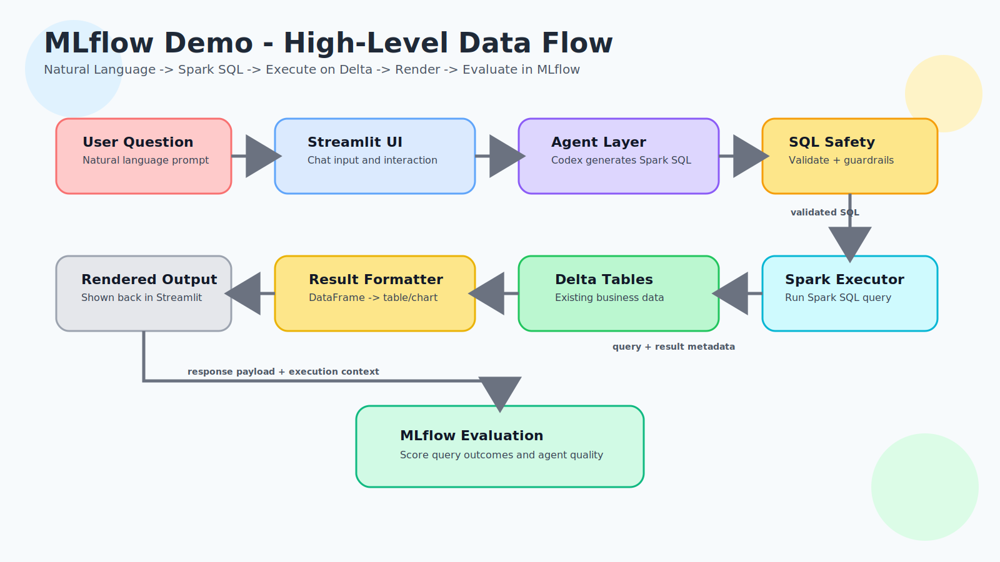

# MLflow Fast Path Demo

Conversational Delta analytics demo scaffolded as a `uv` project.

This demo assumes Delta tables already exist and are accessible.
The demo scope is intentionally simple: natural language -> Spark SQL -> execute on Delta tables -> render results.

## MVP Goal

1. Streamlit UI takes natural language questions.
2. Codex-generated agent translates NL -> Spark SQL.
3. SQL executes against existing Delta tables.
4. Results render in the Streamlit UI.
5. MLflow evaluates query outcomes and agent quality.

## High-Level Data Flow



```text
User (Natural Language Question)
            |
            v
Streamlit UI (chat input + response pane)
            |
            v
Agent Layer (Codex-generated NL -> Spark SQL translation)
            |
            v
SQL Safety Layer (validate + guardrails)
            |
            v
Spark Execution Layer
            |
            v
Delta Tables (existing business data)
            |
            v
Result Formatter (DataFrame -> UI table/summary)
            |
            v
Streamlit UI (render SQL + results)
            |
            v
MLflow Evaluation (query outcome + quality metrics)
```

## Setup

From `demos/mlflow`:

```bash
uv sync
```

## Working Assumption

Use existing Delta tables from local/remote catalog or Unity Catalog OSS.

## Run Tests

```bash
uv run pytest
```
